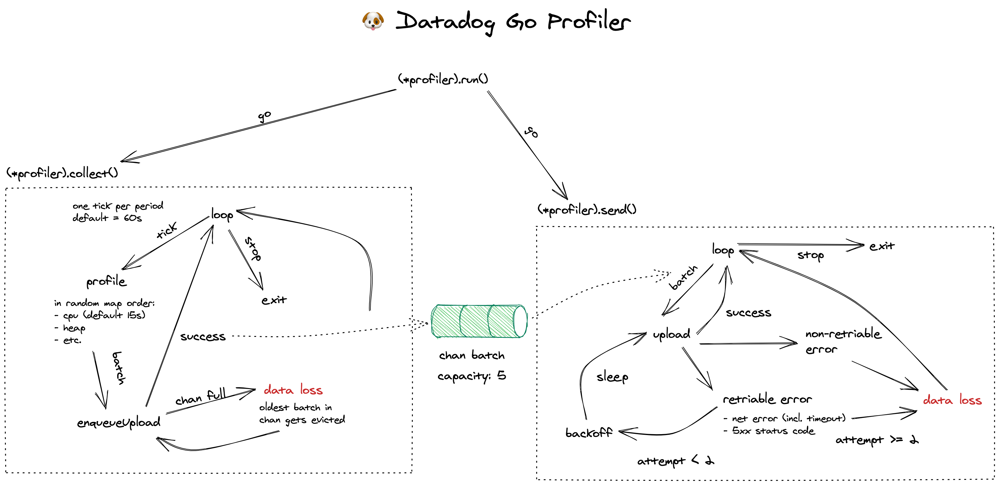

# Datadog's Go Profiler

The profiler code is a sub-package in the [dd-trace-go](https://github.com/DataDog/dd-trace-go/tree/v1/profiler) repo. Basic integration is described in the [Getting Started](https://docs.datadoghq.com/tracing/profiler/getting_started/?tab=go) guide, and the [package docs](https://pkg.go.dev/gopkg.in/DataDog/dd-trace-go.v1/profiler#pkg-constants) explain additional API options. The minimum required Go version is 1.12. 

Users invoke the profiler by calling `profiler.Start()` with a few options, especially tags for identifying the source of the data. Every 60s the profiler then takes a 15s CPU profile as well as a heap profile and uploads it using the [payload format](#payload-format) described below.

The data is sent to the local [datadog agent](https://docs.datadoghq.com/agent/) which forwards it to Datadog's backend. It's also possible to directly upload the profiles without an agent using an API key is given, but this method is deprecated and not supported.

## Operation Details

The [`Start()`](https://pkg.go.dev/gopkg.in/DataDog/dd-trace-go.v1/profiler#Start) function invokes two background goroutines. The `collect()` routine captures profiling data as a `batch` struct and puts it into a Go channel for the `send()` routine to read. More details can be seen below.

A `batch` has a `start` and an `end` time as well as a slice of `profiles`. Each profile corresponds to one of the supported [profile type](https://pkg.go.dev/gopkg.in/DataDog/dd-trace-go.v1/profiler#ProfileType), e.g. CPU, Heap, etc..

## Payload Format

TODO: This is outdated, needs updating [based on this PR](https://github.com/DataDog/dd-trace-go/pull/781).

The payload uses `multipart/form-data` encoding and includes the following form fields for every `batch` that is being uploaded.

- `format`: Always `pprof`
- `runtime`: Always `go`
- `recording-start`:  The batch start time formatted as `2006-01-02T15:04:05Z07:00` in UTC.
- `recording-end`: The batch end time formatted as `2006-01-02T15:04:05Z07:00` in UTC.
- `tags[]`: The profiler's `p.cfg.tags` + `service:p.cfg.service` + `env:p.cfg.env` + `host:bat.host` (if set) + `runtime:go`
- `types[0..n]`: The comma separates types included in each profile, e.g. `alloc_objects,alloc_space,inuse_objects,inuse_space`.
- `data[0..n]`: One file field for each profile. The filename is always `pprof-data`, and the pprof data is compressed (by Go).

TODO: Link to a sample payload file.